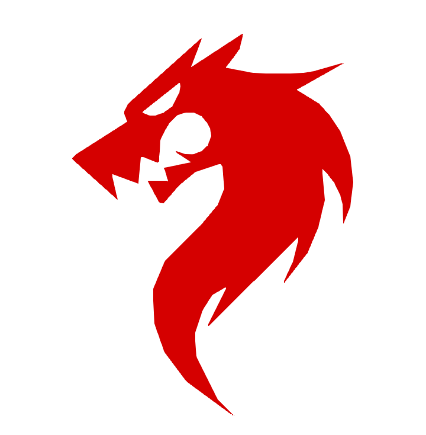

# Dragon Programming language
## About 
##### Dragon is 

## Things i did
- Redesigned the header
- Added little styles to the banner section
- Trying to reduce the use of bootstrap
- Show the hidden social icons and change it to a link
- Added a wave background to the bottom of the hero section
- Restyled the button look
- took a photo and use it as a background image
- Added a blur look to the header background.

 ------ 

## Other things to do
- redraw / recreate the logo to be more smooth
- link pages to each other
- Create or redesign the body/ main content of the page to be more attractive
- Remake the footer
-Change the hero section background image to a photo
 `Not really compulsory tho... `
 - Create dragon editor in the browser
 

 ------ 
